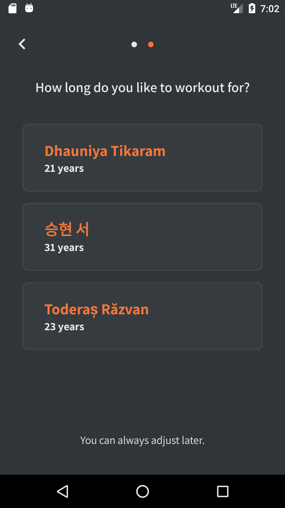

### TopTier Test App

Implemented two screens for the required Sketch.
ViewPager is used as a container for screens (called Step 10 and Step 1).
Step 10 screen just has static data.
Step 11 screen displays the data from the uinames.com API: ​ https://github.com/thm/uinames.

#### The app is a one-Activity project with several Fragments. Used the following technical stack:
- Java;
- MVVM architecture;
- Android Architecture Components:  LiveData, ViewModel,  Navigation;
-  Libraries: Dagger2, RxJava2, Retrofit2.

